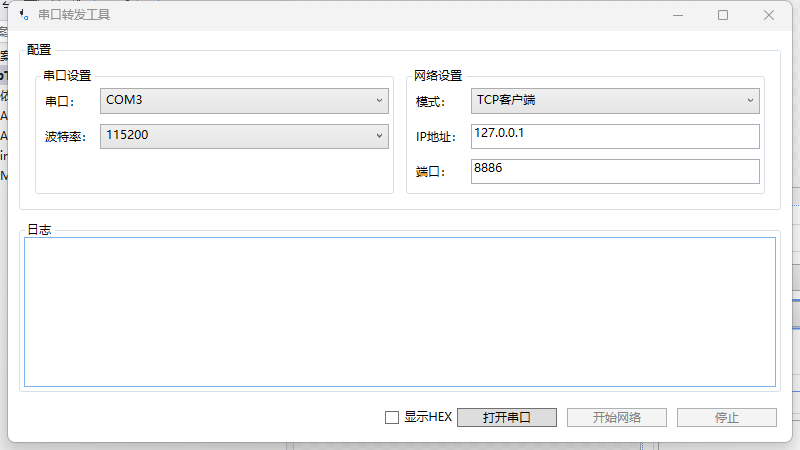
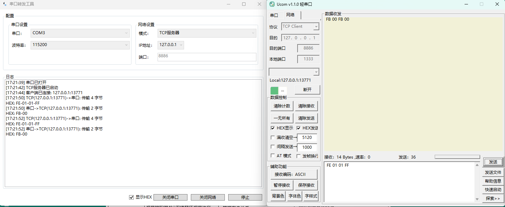

# 串口转发工具

一个基于 .NET 8 WPF 开发的串口转发工具，支持 TCP 和 UDP 协议，可以实现串口数据的双向转发。

## 功能特点

- 支持串口到网络的双向数据转发
- 支持多种网络模式：
  - TCP 客户端
  - TCP 服务器
  - UDP 客户端
  - UDP 服务器
- 自动检测并列出可用串口
- 支持常用波特率设置
- 实时数据监控和日志显示
- 支持 HEX 格式显示数据
- 简洁直观的用户界面

## 界面预览

### 主界面

### 数据传输示例

## 使用说明

1. 串口设置
   - 选择需要使用的串口
   - 设置合适的波特率（默认 115200）

2. 网络设置
   - 选择工作模式（TCP客户端/服务器，UDP客户端/服务器）
   - 设置 IP 地址和端口
   - TCP/UDP 服务器模式下可选择监听地址

3. 操作步骤
   - 打开串口
   - 启动网络连接
   - 查看数据传输日志
   - 可选择是否以 HEX 格式显示数据

## 系统要求

- Windows 操���系统
- .NET 8.0 运行时
- 可用串口设备

## 开发环境

- Visual Studio 2022
- .NET 8.0
- WPF (Windows Presentation Foundation)

## 下载和安装

[releases下载链接](https://github.com/zh3305/TcpTransferSerialPort/releases)

## 更新日志

### v1.0.0 (2024-12-26)
- 初始版本发布
- 实现基本的串口转发功能
- 支持 TCP/UDP 协议
- 添加 HEX 显示功能

## 开发计划

### 近期计划 (v2.0.0)
- [ ] 使用 Avalonia UI 重构，实现跨平台支持
  - Windows
  - Linux
  - macOS
- [ ] 支持 AOT 编译，提升启动性能
- [ ] 优化内存使用
- [ ] 改进日志系统
- [ ] 添加配置文件支持
- [ ] 支持多串口同时转发
- [ ] 添加数据包过滤功能
- [ ] 支持数据包自定义格式化
- [ ] 添加数据统计功能
- [ ] 支持脚本化配置
- [ ] 添加插件系统
- [ ] 支持更多协议

## 问题反馈

如果您在使用过程中遇到任何问题，请提交 Issue。

## 贡献指南

欢迎提交 Pull Request 来改进这个项目。

## 许可证

MIT License

## 致谢

感谢所有贡献者和使用到的开源项目。
